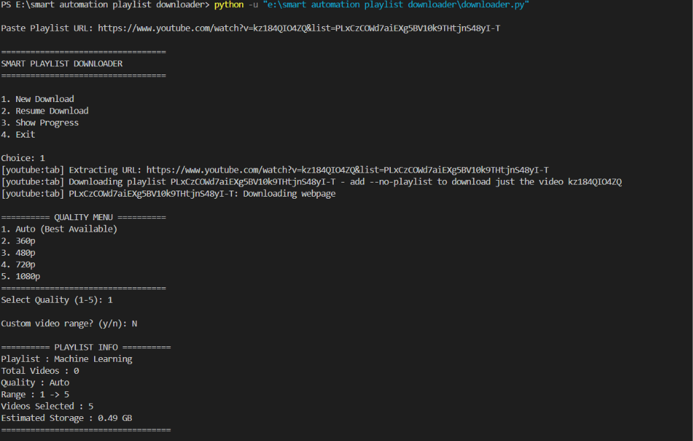
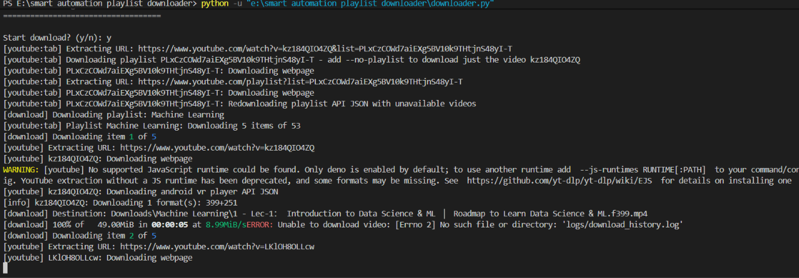
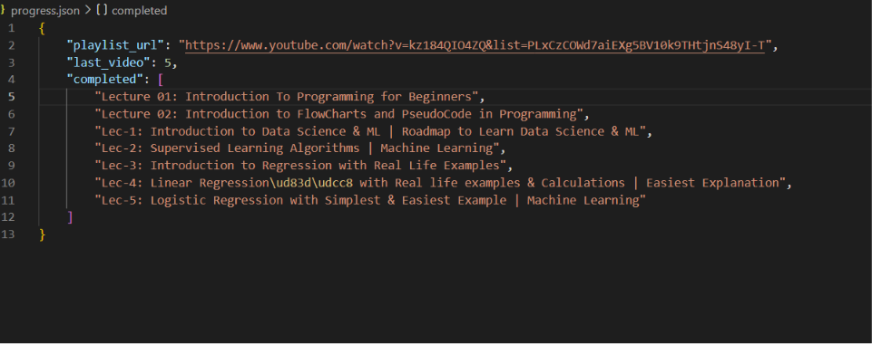

# Smart Playlist Downloader

A Python-based YouTube playlist downloader with resume support, progress tracking, logging, quality selection, and storage estimation.

---

## Features

- Download complete YouTube playlists
- Resume interrupted downloads
- Custom video range selection
- Quality selection
  - Auto
  - 360p
  - 480p
  - 720p
  - 1080p
- Progress tracking using JSON
- Download history logging
- Storage estimation
- Playlist information preview
- Command Line Interface (CLI)

---

## Screenshots

### Playlist Information



### Download Progress



### Progress Report



---

## Project Structure

```text
smart-playlist-downloader/
│
├── downloader.py
├── tracker.py
├── logger.py
│
├── config.json
├── progress.json
├── requirements.txt
├── README.md
│
├── logs/
│   └── download_history.log
│
├── Downloads/
│
└── screenshots/
```

---

## Installation

Clone the repository:

```bash
git clone https://github.com/amit112763/smart-playlist-downloader.git
```

Move into the project directory:

```bash
cd smart-playlist-downloader
```

Install dependencies:

```bash
pip install -r requirements.txt
```

## Usage

Run the application:

```bash
python downloader.py
```

Paste a playlist URL:

```text
Paste Playlist URL:
https://www.youtube.com/playlist?list=XXXXXXXX
```

Choose:

- Download Quality
- Video Range
- Resume Download
- Progress Report

---

## Requirements

## Requirements

- Python 3.10+
- yt-dlp
- rich

## Example Workflow

```text
1. Paste Playlist URL
2. Select Quality
3. Select Video Range
4. Start Download
5. Track Progress
6. Resume Anytime
```

---

## Future Improvements

- Rich terminal UI
- Download scheduler
- Playlist history
- GUI version
- Multi-playlist queue support

---

## License

MIT License